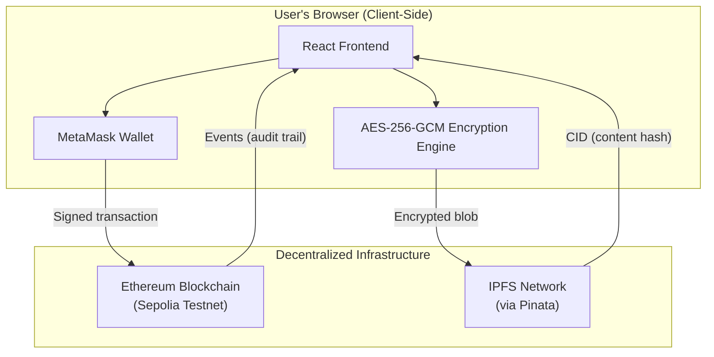
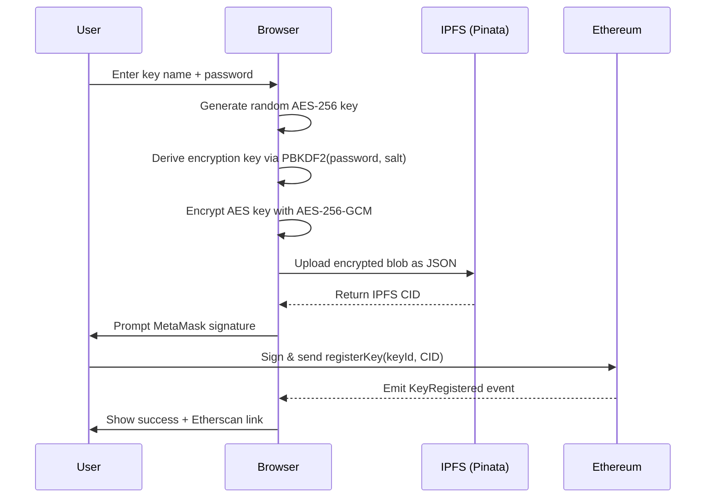
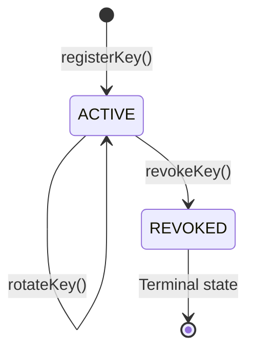

# Blockchain-Based Key Management System — Project Report

> **Course**: Cryptography and Network Security
> **Live Application**: [key-management-system-blockchain.vercel.app](https://key-management-system-blockchain.vercel.app/)
> **Verified Smart Contract**: [Etherscan (Sepolia)](https://sepolia.etherscan.io/address/0x5D62127C6307C05ca7E9dfC7d45f5d460921a3B9#code)
> **Source Code**: [GitHub Repository](https://github.com/dormeneur/Key-Management-System-Blockchain)

---

## 1. Problem Statement

Traditional Key Management Systems (KMS) rely on **centralized servers** to store and manage cryptographic keys. This creates critical vulnerabilities:

- **Single point of failure** — if the server goes down, all keys become inaccessible.
- **Insider threats** — administrators with server access can read, copy, or tamper with keys.
- **No tamper-proof audit trail** — logs stored on the same server can be modified or deleted.
- **Trust dependency** — users must blindly trust the organization managing their keys.

**Our Solution**: A hybrid, decentralized KMS that uses blockchain for tamper-proof lifecycle tracking and IPFS for distributed encrypted storage — ensuring no single entity ever has access to plaintext keys.

---

## 2. Project Objectives

1. Build a working web application that demonstrates secure key lifecycle management (register, rotate, revoke).
2. Ensure **zero-knowledge architecture** — the system never sees or stores plaintext keys.
3. Create an **immutable, verifiable audit trail** using blockchain events.
4. Use **industry-standard cryptographic algorithms** for key encryption.
5. Deploy on free-tier infrastructure suitable for a college demonstration.

---

## 3. System Architecture

### 3.1 High-Level Architecture

### 3.2 Three-Layer Design

| Layer | Responsibility | Where It Runs |
|-------|---------------|---------------|
| **Encryption Layer** | Generates keys, encrypts them with a user password using AES-256-GCM | Entirely in the user's browser |
| **Storage Layer** | Stores encrypted key blobs on IPFS, a distributed file system | Pinata (IPFS gateway) |
| **Lifecycle Layer** | Tracks key state (active/revoked), ownership, and timestamps on-chain | Ethereum Sepolia blockchain |

> **Key Principle**: The plaintext key **never leaves the browser**. The blockchain only stores metadata (IPFS content hash, state, timestamps). IPFS only stores the encrypted blob. Only the user with the correct password can decrypt.

---

## 4. Cryptography and Network Security Concepts Used

### 4.1 Symmetric Encryption — AES-256-GCM

| Property | Detail |
|----------|--------|
| **Algorithm** | Advanced Encryption Standard (AES) |
| **Key Size** | 256 bits (highest AES tier) |
| **Mode** | Galois/Counter Mode (GCM) |
| **IV Size** | 96 bits (12 bytes), randomly generated per encryption |
| **Authentication Tag** | 128 bits (built into GCM) |

**Why AES-256-GCM?**
- AES-256 is approved by NIST and used by governments worldwide for TOP SECRET data.
- GCM mode provides both **confidentiality** (encryption) and **integrity** (authentication) in a single operation — this is called **Authenticated Encryption with Associated Data (AEAD)**.
- If even a single bit of the ciphertext is tampered with, GCM decryption will fail and reject the data, protecting against tampering attacks.

### 4.2 Key Derivation — PBKDF2

| Property | Detail |
|----------|--------|
| **Algorithm** | Password-Based Key Derivation Function 2 (PBKDF2) |
| **Iterations** | 100,000 |
| **Hash Function** | SHA-256 |
| **Salt** | 128 bits (16 bytes), randomly generated per key |
| **Output** | 256-bit AES key |

**Why PBKDF2?**
- Users provide a password, but AES needs a fixed-length 256-bit key. PBKDF2 transforms the password into a cryptographic key.
- The **100,000 iterations** make brute-force attacks computationally expensive — an attacker trying millions of passwords would need significant time and resources.
- A **random salt** ensures that two users with the same password get different derived keys, defeating precomputed rainbow table attacks.

### 4.3 Cryptographic Hashing — Keccak-256

| Property | Detail |
|----------|--------|
| **Algorithm** | Keccak-256 (SHA-3 family) |
| **Output** | 256-bit hash (32 bytes) |
| **Usage** | Generating unique key identifiers from human-readable names |
| **Property** | Collision-resistant, one-way function |

**Why Keccak-256?**
- It is the native hashing algorithm of the Ethereum blockchain.
- Human-readable key names (e.g., "MyAppKey") are hashed into fixed-length 32-byte identifiers for efficient on-chain storage and lookup.
- Being a one-way function, the original key name cannot be recovered from the hash alone.

### 4.4 Digital Signatures — ECDSA (secp256k1)

| Property | Detail |
|----------|--------|
| **Algorithm** | Elliptic Curve Digital Signature Algorithm (ECDSA) |
| **Curve** | secp256k1 |
| **Key Size** | 256-bit private key, 512-bit public key |
| **Usage** | Every blockchain transaction is signed by the user's MetaMask wallet |

**Why ECDSA?**
- Ethereum uses ECDSA with the secp256k1 curve for all transaction authentication.
- When a user registers, rotates, or revokes a key, MetaMask signs the transaction with their private key — proving ownership without revealing the private key.
- This provides **non-repudiation**: once a transaction is signed and confirmed, the user cannot deny having performed that action.

### 4.5 Content-Addressed Storage — IPFS

| Property | Detail |
|----------|--------|
| **System** | InterPlanetary File System (IPFS) |
| **Addressing** | Content Identifier (CID) — a hash of the file's content |
| **Provider** | Pinata (free tier, IPFS pinning service) |

**Why IPFS?**
- Traditional URLs point to a location (server). IPFS CIDs point to **content** — if the content changes, the CID changes.
- This provides **integrity verification**: the CID stored on the blockchain can be used to verify that the encrypted blob on IPFS hasn't been modified.
- Decentralized storage means no single server controls the data.

### 4.6 Blockchain Immutability — Ethereum

| Property | Detail |
|----------|--------|
| **Network** | Ethereum Sepolia Testnet |
| **Consensus** | Proof of Stake (PoS) |
| **Smart Contract** | Solidity 0.8.20 with OpenZeppelin security libraries |

**Why Blockchain?**
- Once a transaction is confirmed on the blockchain, it **cannot be altered or deleted** — this creates a tamper-proof audit trail.
- Every key registration, rotation, and revocation is recorded as a blockchain **event**, with timestamps and transaction hashes that anyone can independently verify on Etherscan.
- **Access control** is enforced by the smart contract itself — only the wallet address that registered a key can rotate or revoke it.

---

## 5. Security Properties Achieved

| Security Property | How We Achieve It |
|---|---|
| **Confidentiality** | AES-256-GCM encryption — only the password holder can decrypt |
| **Integrity** | GCM authentication tag detects any ciphertext tampering; IPFS CID verifies storage integrity |
| **Authentication** | ECDSA digital signatures via MetaMask — every action is wallet-authenticated |
| **Non-repudiation** | Blockchain transactions are permanently signed — actions cannot be denied |
| **Access Control** | Smart contract `onlyKeyOwner` modifier — only the registering wallet can manage its keys |
| **Availability** | Decentralized storage (IPFS) and blockchain — no single point of failure |
| **Auditability** | Blockchain events create an immutable, publicly verifiable timeline |
| **Forward Secrecy (partial)** | Key rotation generates a completely new key with fresh IV and salt |

---

## 6. Key Features & Application Flow

### 6.1 Core Features
- **Dashboard**: View all registered keys, check status (Active/Revoked), and audit lifecycle events.
- **Encrypt/Decrypt Playground**: Interactive tab to test keys with real messages.
- **Key Rotation**: Securely update underlying key material without changing the Key ID.
- **Revocation**: Permanently disable compromised keys.

### 6.2 Key Registration Flow

### 6.3 Key Rotation Flow

1. User clicks "Rotate" on an active key and enters their password.
2. A **new** random AES key is generated in the browser.
3. The new key is encrypted with the user's password (new random IV and salt).
4. The new encrypted blob is uploaded to IPFS, receiving a **new CID**.
5. The smart contract is called with the new CID, replacing the old reference.
6. The old CID remains on IPFS but the blockchain now points to the new one.

### 6.4 Key Revocation Flow

1. User clicks "Revoke" and confirms the irreversible action.
2. The smart contract changes the key's state from `ACTIVE` to `REVOKED`.
3. A `KeyRevoked` event is emitted, permanently recorded on the blockchain.
4. Once revoked, the key **cannot** be rotated, re-activated, or re-registered.

### 6.5 Encrypt/Decrypt Playground Flow

The **Playground** demonstrates the real-world utility of the KMS by allowing users to use their managed keys for actual cryptographic operations.

1.  **Select Key**: User selects an active key from their wallet.
2.  **Unlock**: User enters the password used during registration.
3.  **Fetch & Decrypt**:
    - The application fetches the encrypted key blob from **IPFS** using the on-chain CID.
    - The blob is decrypted in the browser using the provided password (PBKDF2 derivation).
    - This reveals the **raw AES-256 key** in memory (never stored to disk).
4.  **Encrypt Message**:
    - User types a plaintext message.
    - The **raw KMS key** is used to encrypt the message via **AES-256-GCM**.
    - Output: Ciphertext + IV + Auth Tag.
5.  **Decrypt Message**:
    - The ciphertext is decrypted using the same active session key to verify integrity.
    - Demonstrates a complete cycle: *Register → Store → Retrieve → Unlock → Use*.

---

## 7. Technology Stack

| Technology | Purpose | Why This Choice |
|------------|---------|-----------------|
| **Solidity 0.8.20** | Smart contract language | Industry standard for Ethereum; built-in overflow protection |
| **OpenZeppelin** | Security library | Audited, battle-tested contracts (we use `ReentrancyGuard`) |
| **Hardhat** | Development framework | Compile, test, deploy, and verify contracts in one toolchain |
| **React 18** | Frontend framework | Component-based UI with efficient re-rendering |
| **Vite** | Build tool | Fast development server with hot module replacement |
| **ethers.js v6** | Blockchain interaction | Lightweight library to call smart contract functions |
| **Web Crypto API** | Encryption engine | Browser-native cryptography — no external dependencies, hardware-accelerated |
| **MetaMask** | Wallet & signer | Most widely used Ethereum wallet; handles key management and transaction signing |
| **Pinata** | IPFS pinning service | Free tier with reliable API for uploading and retrieving files on IPFS |
| **Ethereum Sepolia** | Test blockchain | Free testnet with real Ethereum infrastructure for demonstrations |
| **Vercel** | Frontend hosting | Free tier with automatic HTTPS; integrates with GitHub for CI/CD |

---

## 8. Smart Contract Design

### 8.1 State Management

The contract maintains two core data structures:

| Data Structure | Type | Purpose |
|---|---|---|
| `keys` | `mapping(bytes32 → KeyMetadata)` | Stores metadata for each key (CID, state, timestamps, owner) |
| `userKeys` | `mapping(address → bytes32[])` | Lists all key IDs belonging to a wallet address |

### 8.2 Key States

### 8.3 Events (Audit Trail)

| Event | Emitted When | Data Recorded |
|-------|-------------|---------------|
| `KeyRegistered` | New key is registered | keyId, IPFS CID, owner address, timestamp |
| `KeyRotated` | Key is rotated with new material | keyId, new IPFS CID, timestamp |
| `KeyRevoked` | Key is permanently revoked | keyId, owner address, timestamp |

### 8.4 Security Features

- **ReentrancyGuard** — prevents reentrancy attacks on state-changing functions.
- **Custom errors** — gas-efficient error handling (e.g., `KeyAlreadyExists`, `Unauthorized`).
- **Checks-Effects-Interactions pattern** — state is updated before any external calls.
- **Access control** — `onlyKeyOwner` modifier ensures only the registering wallet can manage a key.

---

## 9. Frontend Architecture — MVVM Pattern

| Layer | Files | Responsibility |
|-------|-------|---------------|
| **Model** | `KeyModel.js` | Pure data class representing key metadata |
| **View** | `App.jsx`, `Dashboard`, `EncryptDecryptPlayground` | Tabbed interface (Home/Playground), Key Management, and Encryption UI |
| **ViewModel** | `useKeyLifecycle.js` | Business logic, state management via `useReducer`, orchestrates services |
| **Services** | `EncryptionService`, `IPFSService`, `KeyLifecycleService` | Handles cryptography, IPFS, and blockchain calls |

### 9.1 User Interface Enhancements
- **Tab Navigation**: Seamless switching between **Home** (Dashboard) and **Playground**.
- **Visual Feedback**: Real-time **shimmer** animations for encryption and **pulse** effects for decryption success.
- **Educational Context**: Interactive info cards explaining **Rotate vs. Revoke** operations.
- **Responsive Design**: Minimalistic, premium UI using CSS variables and SVG iconography.

This separation ensures the UI never directly touches encryption logic or blockchain calls, making the codebase maintainable and testable.

---

## 10. Why This Project Is Important

### 10.1 Real-World Relevance

- **Data breaches** involving cryptographic keys lead to massive security incidents. A decentralized KMS reduces the attack surface by eliminating centralized key stores.
- **Regulatory compliance** (GDPR, HIPAA, PCI-DSS) requires auditable key management practices — blockchain provides immutable audit trails naturally.
- **Zero-trust architecture** is the modern security paradigm — this project demonstrates zero-knowledge key management where even the system operator cannot access plaintext keys.

### 10.2 Educational Value

This project demonstrates the practical application of multiple CNS topics in a single working system:

| CNS Topic | Where It Appears |
|-----------|-----------------|
| Symmetric encryption | AES-256-GCM for key material encryption |
| Key derivation functions | PBKDF2 for password-to-key transformation |
| Cryptographic hashing | Keccak-256 for key identifiers |
| Digital signatures | ECDSA via MetaMask for transaction authentication |
| Public key infrastructure | Ethereum wallet addresses as identity |
| Secure storage | IPFS content-addressed storage with integrity verification |
| Access control | Smart contract ownership checks |
| Audit trails | Blockchain event logging |

---

## 11. Future Enhancements

| Enhancement | Description | Impact |
|-------------|-------------|--------|
| **Multi-party key sharing** | Allow key owners to grant read access to other wallet addresses using asymmetric encryption (RSA/ECIES) | Enables team-based key management |
| **Hardware wallet support** | Integrate Ledger/Trezor for enterprise-grade key signing | Stronger authentication for high-value keys |
| **Key expiration policies** | Auto-rotate or auto-revoke keys after a configurable time period | Enforces security best practices automatically |
| **Role-based access control** | Add admin/auditor roles with different permission levels | Enterprise use case with separation of duties |
| **Mainnet deployment** | Deploy on Ethereum mainnet or a Layer 2 (Polygon, Arbitrum) for production use | Real-world deployment with lower gas costs |
| **Decentralized identity (DID)** | Replace wallet-based identity with W3C DID standards | Interoperability with broader identity systems |
| **Threshold cryptography** | Require M-of-N approvals for sensitive operations (e.g., revocation) | Prevents single points of compromise |
| **Mobile application** | Build a React Native or Flutter app with WalletConnect integration | On-the-go key management |
| **Key usage logging** | Track when and where decrypted keys are used | Complete lifecycle visibility |
| **Zero-knowledge proofs** | Prove key ownership without revealing the key or metadata | Enhanced privacy for sensitive applications |

---

## 12. Comparison with Traditional KMS

| Aspect | Traditional KMS (e.g., AWS KMS, Azure Key Vault) | Our Blockchain KMS |
|--------|--------------------------------------------------|-------------------|
| **Trust Model** | Trust the cloud provider | Trustless — cryptographic guarantees |
| **Audit Trail** | Provider-managed logs (can be modified) | Immutable blockchain events |
| **Key Storage** | Provider's hardware (HSM) | User's browser + encrypted IPFS |
| **Single Point of Failure** | Yes (provider outage = no access) | No (decentralized infrastructure) |
| **Access Control** | IAM policies (provider-managed) | Smart contract (code-enforced) |
| **Transparency** | Closed source | Open source, verified on Etherscan |
| **Cost** | Pay-per-use (can be expensive) | Free (testnet) or minimal gas fees |
| **Scalability** | High | Limited by blockchain throughput |
| **Compliance** | Provider certifications (SOC 2, etc.) | Self-auditable |

---

## 13. Deployed Artifacts

| Artifact | Link |
|----------|------|
| **Live Application** | [key-management-system-blockchain.vercel.app](https://key-management-system-blockchain.vercel.app/) |
| **Smart Contract (Verified)** | [Etherscan — 0x5D621...1a3B9](https://sepolia.etherscan.io/address/0x5D62127C6307C05ca7E9dfC7d45f5d460921a3B9#code) |
| **Source Code** | [GitHub — dormeneur/Key-Management-System-Blockchain](https://github.com/dormeneur/Key-Management-System-Blockchain) |
| **Network** | Ethereum Sepolia Testnet |
| **IPFS Gateway** | [gateway.pinata.cloud](https://gateway.pinata.cloud) |

---

## 14. Conclusion

This project demonstrates how modern cryptographic primitives and decentralized technologies can be combined to build a practical, secure key management system. By keeping encryption client-side, storing encrypted data on IPFS, and recording lifecycle events on the Ethereum blockchain, we achieve a system where:

- **No single entity** can access plaintext keys.
- **Every action** is permanently recorded and publicly verifiable.
- **Ownership** is cryptographically enforced, not policy-enforced.

The project serves as both a working prototype and an educational tool, illustrating real-world applications of symmetric encryption, key derivation, digital signatures, hashing, and distributed systems — all core topics in Cryptography and Network Security.
